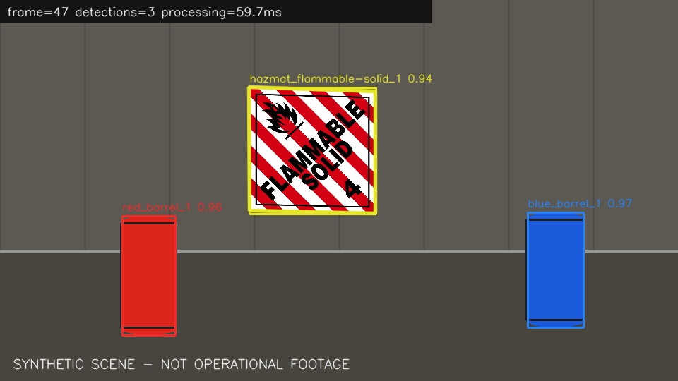

# Crisis Vision Lab — Hazard Sign & Barrel Detection / Tracking

[](https://github.com/cagataykavas/detectHazardsAndBarrels/actions/workflows/ci.yml)

An explainable classical computer-vision pipeline for detecting hazardous-material placards and colored barrels in crisis-scene video. The repaired application packages the original academic prototype into a reproducible, headless pipeline with typed configuration, tracking, versioned JSONL evidence, tests, CI, and a deterministic generated demo.

The core techniques remain intentionally classical: **SIFT feature matching, Lowe ratio filtering, RANSAC homography validation, HSV segmentation, morphology, contour analysis, and centroid-based temporal association**. This repository is useful precisely because those stages are visible and inspectable rather than hidden behind a pretrained detector.

> This is a portfolio/research baseline, not a certified safety system. It must not be the sole basis for emergency response or hazardous-material handling.



_The preview is generated integration data, not operational footage._

## Provenance

The project began as a university assignment implemented in one large `HW1.py`. The original behavior is preserved in `legacy/HW1_monolith.py` together with the historical assignment notes. The runnable application does **not** import the legacy monolith; it re-expresses the same problem as testable modules.

This matters because several thresholds in the original project were tuned for assignment footage rather than calibrated as universal detection rules. The modernized pipeline makes those assumptions explicit instead of presenting them as production-grade probabilities.

## What the repaired pipeline does

1. Loads HAZMAT reference templates and extracts SIFT descriptors.
2. Reads video frames through a headless processing pipeline.
3. Matches scene descriptors to templates using Lowe's ratio criterion.
4. Estimates a homography with RANSAC and rejects weak or implausible geometry.
5. Detects red and blue barrels with scale-aware HSV masks, morphology, and contours.
6. Associates detections across frames with lightweight centroid tracking.
7. Emits per-frame JSONL records containing geometry, track IDs, scores, and decision evidence.
8. Writes an annotated video, preview frame, and machine-readable summary.

Confidence values are heuristic ranking scores, **not calibrated probabilities**. Detection counts are observations, **not precision/recall**.

## Engineering surface

```text
crisis_vision/
  cli.py          command-line interface
  config.py       typed/validated configuration
  detection.py    barrel + placard detection primitives
  tracking.py     temporal centroid association
  pipeline.py     video orchestration and artifact writing
  models.py       result/evidence data contracts
  templates.py    reference-template loading
  demo.py         deterministic synthetic integration scene
legacy/
  HW1_monolith.py preserved original academic implementation
tests/            detection, tracking, config and pipeline regression tests
docs/             architecture, JSON contract and evaluation guidance
```

## Quick start

```bash
python -m venv .venv
source .venv/bin/activate          # Windows: .venv\Scripts\activate
pip install -e ".[dev]"

# Zero-private-data integration path
crisis-vision demo --output artifacts/demo --frames 48

# Analyze a recording
crisis-vision analyze \
  --input video.mp4 \
  --templates hazmats/hazmats \
  --output artifacts/incident

# Inspect the output contract
crisis-vision explain-schema
```

The historical filename remains a compatibility launcher:

```bash
python HW1.py demo --output artifacts/demo
```

## Artifact bundle

| Artifact | Purpose |
|---|---|
| `events.jsonl` | one explainable record per processed frame |
| `summary.json` | configuration, input metadata, timings and observed tracks |
| `annotated.mp4` | accepted detections, polygons, track IDs and scores |
| `preview.jpg` | final annotated frame for fast review |

A HAZMAT detection contains the evidence used to accept it, for example:

```json
{
  "track_id": "hazmat_flammable-solid_1",
  "label": "flammable-solid",
  "kind": "hazmat",
  "confidence": 0.86,
  "evidence": {
    "decision_rule": "sift_ratio_plus_ransac",
    "good_matches": 42,
    "inlier_ratio": 0.79,
    "polygon_area_ratio": 0.051
  }
}
```

The numbers above illustrate the schema, not a benchmark claim.

## Detection architecture

### HAZMAT placards

Reference images are represented with SIFT keypoints/descriptors. Scene features are matched with a brute-force L2 matcher and Lowe ratio filtering. Candidate correspondences are passed to `findHomography(..., RANSAC)`. The transformed template polygon is then checked for sufficient inliers, plausible area, convexity, and scene bounds before acceptance.

### Colored barrels

Frames are converted to HSV and thresholded with explicit red/blue ranges. Morphological opening/closing suppresses noise; contour geometry and scale-aware area rules produce candidate barrels. The evidence object records the measurements behind each accepted candidate.

### Tracking

A lightweight centroid association layer persists semantic track IDs across frames using distance and disappearance limits. It is deliberately simpler than Kalman/Hungarian or learned trackers, making failure modes easy to inspect. Crossings and abrupt motion can still swap IDs.

## Configuration

```bash
cp config.example.json my-config.json
crisis-vision analyze \
  --input video.mp4 \
  --templates hazmats/hazmats \
  --config my-config.json \
  --output artifacts/incident \
  --max-frames 500
```

Unknown keys and invalid ranges fail before video processing. Important controls include feature-match thresholds, RANSAC/inlier requirements, HSV ranges, contour-size rules, frame stride, and track association limits.

## Evaluation discipline

A useful evaluation needs labeled, representative footage. The repository therefore does not turn generated-demo counts into accuracy claims. A real benchmark should report at least:

- placard precision/recall by template class;
- barrel precision/recall by color/class;
- false positives per processed frame;
- track fragmentation and ID switches;
- sensitivity to blur, scale, illumination and occlusion;
- threshold/configuration version used for the run.

See `docs/evaluation.md` for the fuller protocol.

## Development and CI

```bash
pip install -e ".[dev]"
ruff check .
pytest
crisis-vision demo --output artifacts/smoke --frames 24 --no-video
```

CI runs lint/tests and the generated-data smoke path so the default branch can be checked without private footage.

## Known limitations

- SIFT requires sufficient local texture and degrades under severe blur/glare/occlusion.
- Fixed HSV ranges remain camera/lighting sensitive.
- Similar placards may share local features and compete during template matching.
- Centroid tracking can swap identities at crossings or abrupt motion.
- Generated demo success is an integration check, not evidence of field accuracy.
- A deployment would require licensed templates, representative labeled data, calibrated thresholds and human review.

## Template assets and license

The historical repository did not record the provenance of all bundled placard PNGs. They remain for backwards compatibility/demo use, but reuse rights must be verified before redistribution or commercial deployment. See `ASSET_NOTICE.md`.

Source code and documentation are MIT licensed; bundled image assets are excluded pending provenance verification.
