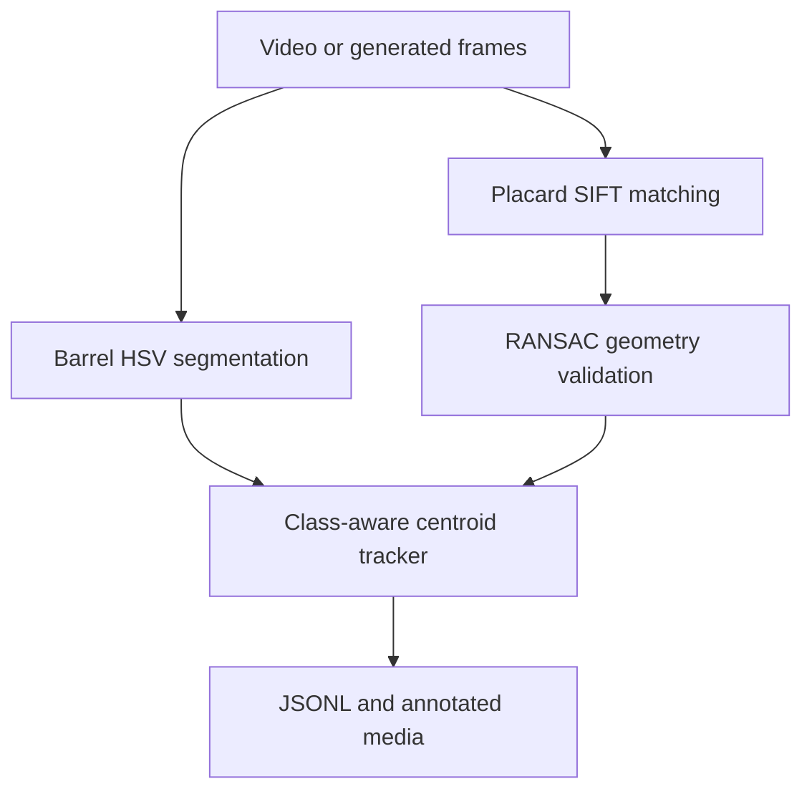

# Architecture

The application separates detection, validation, identity association, and output.
Every accepted object carries the measurements that caused it to pass.

## Components

| Module | Responsibility |
|---|---|
| `config.py` | Validate thresholds and reject misspelled keys |
| `templates.py` | Discover images and precompute SIFT descriptors |
| `detection.py` | Detect barrels and geometrically valid placards |
| `tracking.py` | Associate same-label detections across frames |
| `pipeline.py` | Process frames and write reproducible artifacts |
| `demo.py` | Generate a deterministic warehouse scene |
| `cli.py` | Expose real-video, demo, and schema commands |

## Barrel decision path

1. Convert a frame from BGR to HSV.
2. Build masks for red (two hue bands) and blue.
3. Apply morphological open/close operations.
4. Extract external connected components.
5. Measure contour area ratio, bounding-box aspect ratio, and solidity.
6. Accept only components within every configured range.

Area is divided by frame area, so the baseline does not silently assume the original
assignment's resolution. Confidence combines shape and solidity and is not a
calibrated probability.

## Placard decision path

1. Extract SIFT features from the scene.
2. Match each template with a two-neighbor brute-force matcher.
3. Apply the configurable Lowe ratio test.
4. Require enough matches to estimate a homography.
5. Estimate the homography with RANSAC and require an inlier ratio.
6. Project the template corners into the scene.
7. Reject non-finite, non-convex, too-small, or too-large polygons.
8. Suppress overlapping candidates, retaining the strongest explanation.

The historical script used a RANSAC reprojection threshold of 220 pixels. The repaired
default is 5 pixels, exposed through configuration and recorded in every explanation.

## Tracking

Tracks only compete with detections of the same kind and label. A greedy nearest-
centroid match is accepted within `track_max_distance` in normalized frame space.
Otherwise, a new semantic ID is allocated. Missing tracks expire after
`track_max_missing` processed frames.

This is intentionally understandable. A deployment with crossings or heavy occlusion
should substitute Kalman prediction plus Hungarian assignment while retaining the
public detection and JSON models.

## Failure behavior

- Missing video, template directory, or named demo template returns exit code `2`.
- Templates without at least four SIFT keypoints are skipped.
- A directory with no usable templates fails before processing.
- Frames with no SIFT descriptors may still produce barrel detections.
- Video output can be disabled; JSONL, summary, and preview remain available.
- No GUI window or pause call is used in normal operation.
